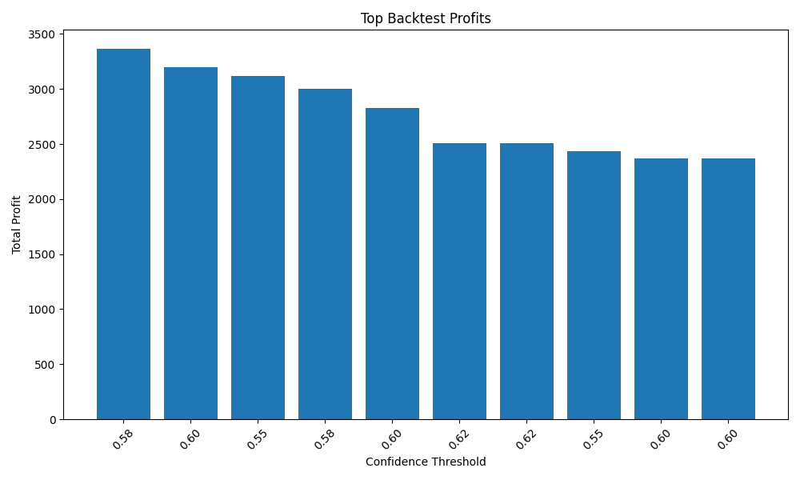

# Data Setup

This project requires data files separately from OneDrive.

## Required folder structure

Trading-System/
├── data/
│   ├── raw/
│   │   ├── options/
│   │   │   └── option_data.csv
│   │   └── price/
│   │       ├── HDFCBANK_minute.csv
│   │       ├── ICICIBANK_minute.csv
│   │       ├── INFY_minute.csv
│   │       ├── NIFTY50_minute.csv
│   │       ├── NIFTYBANK_minute.csv
│   │       ├── RELIANCE_minute.csv
│   │       └── TCS_minute.csv
│   └── processed/
│       ├── combined_data.csv
│       └── features.csv

## Data location

Data is stored in OneDrive Nunnurider account.
Download the data folder and paste it in the project root.


Backtest achieved +488.86 net profit on test sample using confidence filtering, stop loss, target profit, and brokerage simulation.


## Latest Backtest Result

Initial Balance: 100000  
Final Balance: 100488.86  
Net Profit: +488.86  
Total Trades: 11  
Win Rate: 36.36%  
Average Net Profit Per Trade: 44.44  

Settings:
- Confidence Threshold: 0.60
- Stop Loss: 0.20%
- Target: 0.50%
- Capital Per Trade: 100000
- Brokerage: 0.005%
- Hold Candles: 30


## Optimized Backtest Result ACCURCY INCREASE WIN INCREASE

Initial Balance: 100000  
Final Balance: 103368.98  
Total Net Profit: +3368.98  
Total Trades: 14  
Win Rate: 57.14%  
Average Net Profit Per Trade: +240.64  

Settings:
- Confidence Threshold: 0.58
- Stop Loss: 0.25%
- Target Profit: 0.70%
- Hold Candles: 30
- Brokerage: 0.005%


## Features

- Historical market data processing
- Technical indicator based feature engineering
- VWAP, ATR, RSI, Moving Averages, Volume Spike
- Random Forest ML model
- Confidence based trade filtering
- Stop loss and target profit logic
- Brokerage/transaction cost simulation
- Backtest optimization
- GitHub-ready project structure


## Screenshots

### Backtest Result


### Optimization Chart



## Validation & Analysis

### Walk-Forward Validation
- Total Folds Tested: 102
- Total Trades: 18,411
- Average Win Rate: 68.2%

### Risk & Quality Checks
- Leakage check completed
- No duplicate rows
- No infinite values
- No NaN values
- No high-correlation leakage features detected

### Analysis Tools
- Walk-forward testing
- Leakage analysis
- Bad fold analysis
- Backtest optimization 


## **Project Structure**

```text
Trading-System/
├─ src/
│  ├─ features/
│  │  └─ build_features.py
│  ├─ backtest/
│  │  ├─ backtest.py
│  │  ├─ export_trade_logs.py
│  │  ├─ performance_dashboard.py
│  │  ├─ walk_forward_test.py
│  ├─ models/
│  │  ├─ train_model.py
│  │  ├─ load_saved_model.py
│  ├─ api/
│  │  └─ trading_api.py
│  └─ paper_trading_simulator.py
├─ data/
│  ├─ raw/
│  ├─ processed/
├─ trade_logs/
├─ saved_models/
├─ results/
├─ README.md
└─ .gitignore